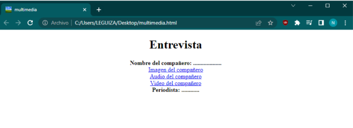
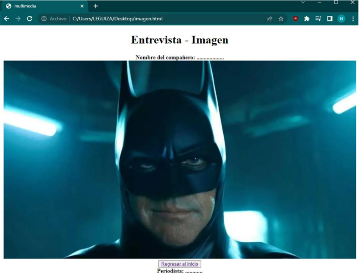
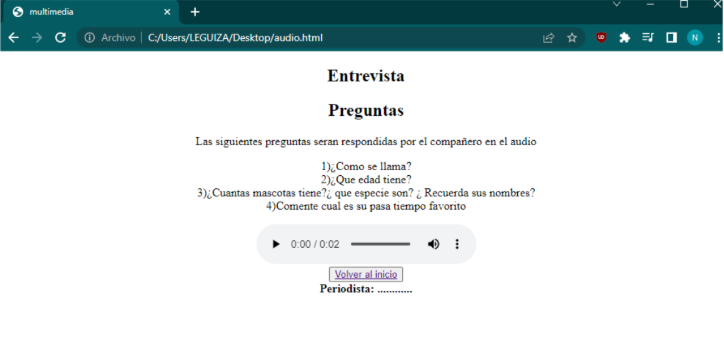
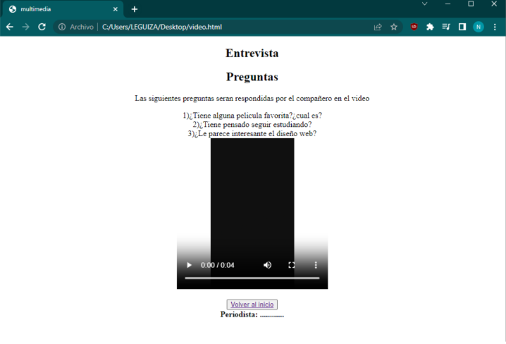

# HTML - Entrevista.

Realizar una entrevista a su compañero y crear un documento HTML, con el contenido de la entrevista.

El icono tiene que ser la misma imagen que utilicen en `imagen del compañero`.

Siguiente a la consigna inicial, en la siguiente imagen podremos observar la página `Imagen`:

Siguiente a la consigna inicial, en la siguiente imagen podremos observar la página `Audio`:

Siguiente a la consigna inicial, en la siguiente imagen podremos observar la página `Video`:

